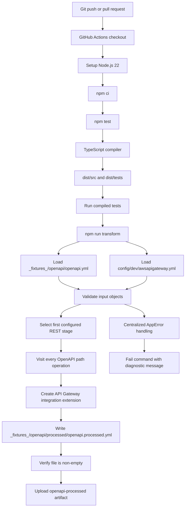

# OpenAPI API Gateway Transformer

This project transforms a base OpenAPI YAML document into an OpenAPI document containing Amazon API Gateway integration extensions. The processed document can then be supplied to an API Gateway deployment process.

## Why `src` and `dist` contain similar folders

`src` contains the TypeScript source code written and maintained by developers. `dist` contains JavaScript generated by the TypeScript compiler. The folders look similar because the compiler preserves the source layout in its output.

The behavior is controlled by [tsconfig.json](tsconfig.json):

```json
{
  "rootDir": ".",
  "outDir": "dist",
  "include": ["src/**/*.ts", "tests/**/*.ts"]
}
```

Because the repository root is the source root, these mappings are expected:

| Source | Compiled output | Purpose |
| --- | --- | --- |
| `src/cli.ts` | `dist/src/cli.js` | Command-line entry point |
| `src/config/` | `dist/src/config/` | YAML loading and validation |
| `src/errors/` | `dist/src/errors/` | Centralized application errors |
| `src/transform/` | `dist/src/transform/` | Integration and OpenAPI transformation |
| `src/types.ts` | `dist/src/types.js` | Runtime-free TypeScript types |
| `tests/` | `dist/tests/` | Compiled Node test files |

`dist` should not be edited manually. Change files under `src` or `tests`, then run `npm run build`. The generated directory is ignored by Git through [.gitignore](.gitignore), so it is a build artifact and can be removed and recreated at any time.

## Project structure

```text
.
├── _fixtures_/openapi/openapi.yml                 Base OpenAPI input
├── _fixtures_/openapi/processed/                  Generated output directory
├── _fixtures_/openapi/processed/openapi.processed.yml
├── config/dev/awsapigateway.yml                   Environment gateway settings
├── src/
│   ├── cli.ts                                     Application entry point
│   ├── config/loadConfig.ts                       YAML loading and config validation
│   ├── errors/AppError.ts                         Application error type
│   ├── errors/handleError.ts                      Common exception boundary
│   ├── transform/integration.ts                   API Gateway integration strategies
│   ├── transform/transformOpenApi.ts              Operation transformation
│   └── types.ts                                    Shared contracts
├── tests/transformOpenApi.test.ts                 TypeScript tests
├── package.json                                   Scripts and dependencies
└── tsconfig.json                                   Compiler configuration
```

## End-to-end flow



## Step-by-step execution

1. A developer or GitHub event starts the workflow in [.github/workflows/deploy.yml](.github/workflows/deploy.yml). It runs for pushes to `main` and `feature*`, and for pull requests targeting `main`.
2. GitHub Actions checks out the repository and installs Node.js 22.
3. `npm ci` installs the exact dependency versions recorded in `package-lock.json`.
4. `npm test` first runs `npm run build`. TypeScript compiles `src/**/*.ts` and `tests/**/*.ts` into `dist`.
5. Node runs the compiled tests from `dist/tests`. A failed test stops the workflow before a processed specification can be published.
6. `npm run transform` builds again and executes `dist/src/cli.js`.
7. The CLI loads the base document from `_fixtures_/openapi/openapi.yml` and the environment configuration from `config/dev/awsapigateway.yml`.
8. The configuration loader verifies that at least one REST stage is present. The transformer uses the first configured stage and its `v0` settings.
9. Every supported HTTP operation under `paths` receives an `x-amazon-apigateway-integration` extension.
10. The transformed document is serialized as YAML and written to `_fixtures_/openapi/processed/openapi.processed.yml`.
11. The workflow verifies that the output file exists and is non-empty, then uploads it as the `openapi-processed` artifact.

## Supported integration types

The `integration-type` value is case-insensitive and accepts hyphenated or underscored forms where applicable.

| Configuration value | API Gateway `type` | Generated behavior |
| --- | --- | --- |
| `VPCLINK` or `vpc-link` | `http_proxy` | Adds `connectionType: VPC_LINK` and a connection ID |
| `HTTP` | `http_proxy` | Proxies the request to the configured backend URL |
| `LAMBDA` | `aws_proxy` | Uses `POST` and the configured Lambda URI |
| `AWSSERVICE` | `aws` | Uses the configured AWS service method and URI |

Optional values are read from the stage `v0` object:

```yaml
v0:
  integration-type: vpc-link
  backend-url: https://internal.example.com
  connection-id: vpclink-identifier
  lambda-uri: arn:aws:apigateway:region:lambda:path/2015-03-31/functions/arn:aws:lambda:region:account:function:name/invocations
  aws-service-http-method: POST
  aws-service-uri: arn:aws:apigateway:region:sqs:path/account/queue
```

When optional backend values are absent, the transformer emits stage-variable placeholders such as `${stageVariables.backendUrl}` and `${stageVariables.vpcLinkId}`. These must be defined by the API Gateway deployment configuration before runtime traffic is sent.

## Local commands

Run these commands from the repository root:

```powershell
npm.cmd ci
npm.cmd test
npm.cmd run transform
```

The `npm.cmd` form works on Windows environments where PowerShell execution policy blocks `npm.ps1`. On Linux runners, the workflow uses the standard `npm` command.

## Error handling

File-system, YAML parsing, invalid documents, missing stages, missing integration types, and unsupported integration types are surfaced through `AppError`. The CLI passes all caught values through `handleError`, which normalizes unknown exceptions into the same application error boundary and causes the process to fail instead of producing a misleading partial output.

## Testing approach

The tests in [tests/transformOpenApi.test.ts](tests/transformOpenApi.test.ts) verify that:

- VPC Link integrations are added to each HTTP operation.
- All four supported integration types produce an integration extension.

Add or update tests under `tests/`. They are compiled and executed by `npm test`; do not add tests directly under `dist`.
